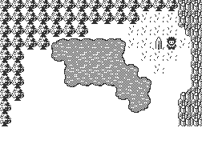

# Jack Explorer

A simple MVC "game" written in the Jack programming language (nand2tetris)

Not much of a game as things stand...



### Usage

```bash
git clone https://github.com/TheInvader360/jack-explorer
```

Then compile using the nand2tetris JackCompiler and run in the nand2tetris VMEmulator, for example:

```bash
./nand2tetris/tools/JackCompiler.sh ./jack-explorer
./nand2tetris/tools/VMEmulator.sh
```
